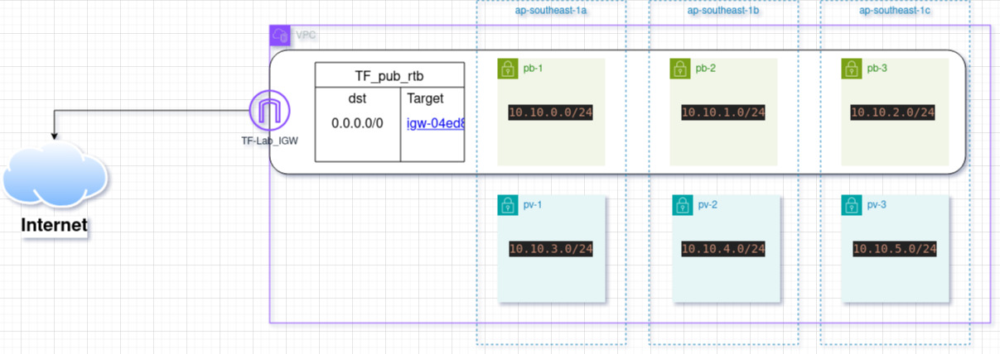

# Terraform_lab
For IAC Learning

Objective
==========
- **Create NEW VPC**
  
- **Create a public subnet and private subnet per each AZ available in the region you choose**

- **All public subnets must associate with one public RTB**

- **All private subnets must associate with one private RTB**

- **Create a variables.tf and declare all variables in that file**

- **Create terraform tfvars or prod.tfvars and set variable values in that file**

# Infrastructure Diagram

